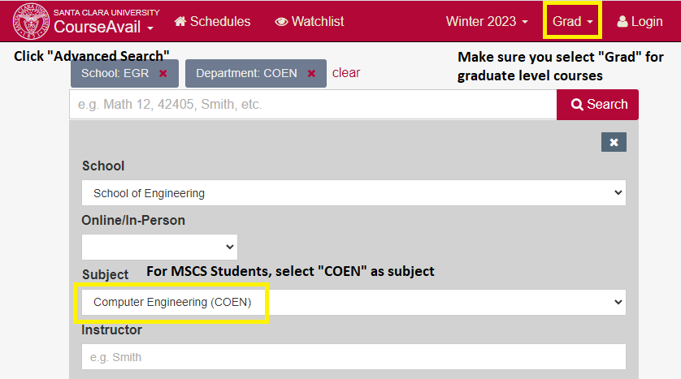
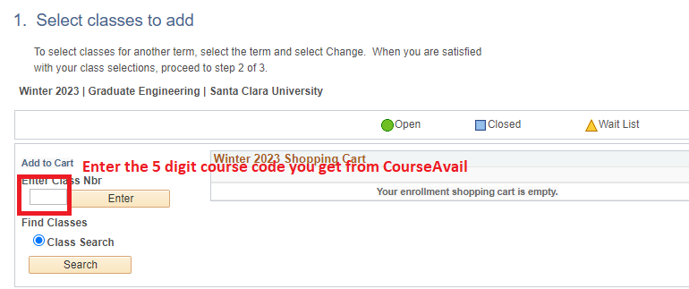

Last Edited: Jan 19, 2023
## About Us
- 我们是SCU MSCSE疫情后恢复线下上课的2022 fall研究生新生，第一学期经历了**混乱的选课**和**极度的信息缺失与不对称**，以至于有同学**GPA一度跌下2.5，威胁到CPT的办理（CPT要求最低GPA需在3.0以上）**。
- 创建此GitHub Repository的目的是帮助来到SCU的**CS弱基础转码**或目标在第一个semester尽量找到实习，一心留美的同学**打破只能通过微信群获取信息的单一途径/壁垒**，努力呈现对于普通学生而言真实的MSCSE课程体验，**尽量让后来者少走弯路**。老中helps老中！如果觉得这个repo对你有帮助可以点击右上角Star收藏。
- 但我们的经验无法覆盖所有课程，也可能有不正确之处。如果你上过的课程没有罗列到，欢迎一起分享经验为后来者减少踩坑几率，可以在Issues里按照【Workload及难度，给分情况，教授情况，是否推荐】四方面写下自己对某门课的评价，也可以给scu_mscse_course_rating@proton.me发邮件联系笔者，可以直接发文字版，或zoom meeting你来口述，笔者来整理成文（出于双方互信，会隐去你的名字在这个repo里发布评价）。
- 感谢所有给本Repo提供经验分享的朋友们！

## Disclaimer 免责声明
- 笔者创建该Repository的全过程不曾与任何校内学生组织/非营利组织/盈利性质公司/宗教团体进行合作，纯粹为出于公益目的且完全自发的个人行为。
- 笔者收集的所有评价一律不针对**学校本身**发表任何言论，仅围绕**课程是否适合转码/找工为主的同学**这一标准进行评价。
- 对于标注为22fall新来的教授，不排除会存在后续调整给分标准（变得更严格/更宽松）的情况，本Repo只收集了22 fall的情况，请酌情考虑时效性。
- 不同人的基础、背景、理解能力都不完全一样，因此不可能做出完全客观符合每位同学情况的评价，在选课中仍然需要以自己的实际情况为主进行选择。每个人都只能为自己的选择负责。

## 如何使用本Repository
- 使用Ctrl+F快捷键，搜索课程编号/课程名称/教授姓氏。
  - 课程编号示例：COEN288（注意不要带空格，不然无法直接跳转到对应的评价）
  - 课程名称示例：Design Patterns
  - 教授姓氏示例：Wang
- 可同时配合Rate My Professor（https://www.ratemyprofessors.com/school?sid=882) 进行使用。如果有教授被提及Tough Grader等评价，珍惜GPA，请务必慎重选择该位教授的课程。

## 选课必知必会
- 下个学期选课的时间通常是在当前学期的第五周（提前批）和开学后的前两周。提前批选课时，每位学生都会被分配一个固定的选课时段（系统会发邮件通知）。一般热门的课在提前批结束前早就被选光了，所以需要注意提前批选课开始结束时机，避免错过时机
> __Note__ 选课优先级：老生 > 新生。已修学分越多，分配的选课时间越靠前。但是根据学生中的多个调查反馈，在修相同学分前提下，会按照姓名首字母顺序安排选课时机。官方的说法是随机分配。
- ${\color{red}$50 退课费}$: 对于 Graduate Engineering 的学生来说，从选课到正式上课前一周（学期开始）退课换课都是免费的，但是之后每退/换一门课需要额外交 ${\color{red}$50}$：https://www.scu.edu/engineering/graduate/academic-calendar/
- ${\color{red}退课款 Deadline}$：正式上课**第一周周日**前 drop 一门课能收到 **100%** 退款，第二周周日前 drop 只能收到 **50%** 退款，第三周 drop 退 **25%**
- 每 quarter 能修的学分上限是 **10 credit units**，相当于两门 4 学分 + 一门 2 学分。如果需要选超过 10 unit，需要提前咨询分配的 academic advisor 意见，填写 overload 表格并且提交给 peer advisor: https://www.scu.edu/engineering/current-student-resources/current-graduate-students/forms/。 **新生无法为第一个 quarter 申请 overload**
- 可通过 CourseAvail https://www.scu.edu/apps/courseavail/?p=schedule 查看课程信息，并通过 eCampus -> SCU Manage Class 选课

- F1 学生每个 quarter 需要至少 enroll 8 学分维持 F1 身份，并且最多只能有一门课（2学分或4学分）是纯线上课程 (online classes)
- SCU CPT Policy: F-1 学生如果需要暑假实习/在读兼职 办理 CPT，必须 enroll ENGR 288/289 这门 1 学分的课，并且满足学校规定的条件：
  https://www.scu.edu/engineering/academic-programs/department-of-computer-engineering/coen-student-policies/
  - ENGR 288 要修满 16学分才能选（Non-transfer SCU credits），ENGR 289 要 24学分

## PoS 表格 - 新生必看
入学前，COEN Peer Advisor - Michael 会给新生们发邮件提交 foundation course 的 waiver form，也是POS的一部分（POS 即 Program of Studies，如果第一学期没能及时提交这个 POS form，会被学校 hold 选课权限，就选不了课了）。
- 对于转码同学来说 7 门 foundation courses 分为两类：
  1. 不算毕业学分需要，自己额外花钱补的三门（汇编逻辑设计数据结构）
  2. 可以算毕业学分的四门（离散数学，概率论，线性代数，高级编程），但是如果成绩单上有类似的课会被 waive 掉就没办法在 SCU 里选。另外，对于(i)类中的逻辑设计这门课（921C: Introduction to Logic Design），如果没能 waive 掉，**只能选择在学校补习**。汇编和数据结构可以去指定的 community college 学习，也可以在学校选课。**麻烦的原因在于不仅要多花额外的学费，而且还有一定风险难以通过。身边有转码的朋友虽然认真学了，但是上920C那门汇编课拿了 C 以下的。**
- **Foundation Course 怎么 waive**：如果成绩单上有类似名字的课，可以发 syllabus 给 Michael，最终由 Michael 和你的 advisor 共同决定能否 waive。但是基于文商转码的同学大部分背景都和CS相距甚远，**920c 和 921c 基本没办法waive**。可以尝试和 academic advisor 当面 zoom meeting 沟通，增加 waive 的几率。但是现在这个时间点来说 waive 的难度较大。如果想 waive 需要当着 Michael 面做题，或者参加学校里这两门课的期末考试并拿到C以上。
- **没法waive这些课只能硬上怎么办**：
  1. **如果对自己的自学能力没有充分且强大的自信，不要在第一学期GPA不稳定的时候选**：汇编和 logic 对文商转码的同学来说难度较大，而且学校里上这门课的老师讲课不是很好，据身边上过课的转码新生同学反应，考试和平日上课的ppt关系不大。
  2. **尽量去 Community College 补课**：学校会给一个可以补课的 cc list，可以组队一起学。

## Part 0. 评价标准
- 总体标准：身兼找工压力的人和已经拿到实习/全职Offer的人的选课思路应该是不一样的。
- To be specific，前者更适合上【给分合理】【难度适中】的课。这不仅是因为在找工时（特别是转码的同学）很难应对找工面试导致的时间分配压力，更是因为如果遇到给分严格的教授（如给C-/对应GPA1.7），**对于国际生而言极度可能导致CPT无法办理/无法毕业**，让自己陷入被动局面。后者在找工压力减轻的前提下可以基于自己对CS领域的兴趣和热情选择【对基础要求更高】【更能学到东西】的课。
- 因此对于上过的课，评价时会尽量分为以下几点：
  - Workload与难度
  - 给分情况
  - 教授情况
  - 是否推荐

## Part 1. 转码先修课 Foundation Courses: COEN 912/920C/921C
- 这三门课在Waiver Form中不算毕业46学分，需通过本科成绩单Waive或在CC补课，如果Waive失败则需要额外付钱修。
- 如选择在学校上，则这三门课的教授都是同一位，C. Fussell
- ${\color{red}先修课要前三个学期上完，但有些课不是每个学期都开的}$

### COEN920C Embedded Systems and Assembly Language
- **Workload与难度:** 作业不需要提交，但需要练习，做题要熟练，不然考试照着cheatsheet都会来不及。
- **给分情况：** 纯粹由考试组成，两次quiz30%，midterm30%，final40%。midterm考了很多array index的问题，这部分内容midterm之后才开始讲，可谓措手不及。Final也是考了很多最后两章的内容，而老师只花了一周的时间草草过一遍，出现了不少homework也没见过的题型。虽然可以带cheatsheet，但由于题量很大查阅也会耗时，导致不少人在这节课翻车，保持每次都在平均分大概能保住B，而每次只比平均分低一两分都可能到C。homework的题型只能保住B grade，会有一些没见过的考题。**甚至会给到D的grade。**
- **教授情况：** 教学质量堪忧，纯粹念ppt且语调催眠。考试完会有zoom review，但不发solution。可发邮件咨询问题，可zoom，但没有office hour。
- **是否推荐：** 上过的科班出身同学表示：“（无论是否有工作Offer）都没有任何理由选这门课以及912/921，纯属花钱买罪受，还不算毕业credit。” 建议尝试各种办法Waive，不然就去de anza上网课。笔者补充：如果觉得还是需要补习一下这方面的知识，也建议尽量不要在第一个quarter选，可以等自己适应一段时间学校的学习节奏之后再选。

## Part 2. COEN Core Courses （核心课程）
- 绝大多数同学的Core Course: 279（算法），283（操作系统），210（Computer Architecture）。据说极个别CS科班同学也有这三门课被Waive，因此只能选这三门课Advanced版本的情况（279->**3**79,283->**3**83,...）。
- 对于这三门核心课程，每quarter通常会有1-3名教授同时提供课程。由于每年的授课教师安排都不一样，因此笔者这里只能对于每门课汇总所有教过的老师，无法提供【该老师在哪个学期一定会开】的相关信息。

### 2.1 COEN279 Design & Analysis of Algorithms
目前已知的有以下教授上过：（不完全名单）
- 教授1: N. Tran
  - **Workload与难度:** Workload方面，每周都有作业，每次作业2-3道题，基本要花费半天-一天的时间研究才能确保正确率。考试共2次（期中+期末），题量较大，需要手写代码且不允许携带CheatSheet。难度方面，期中考试之前相比于算法，更像数学证明课，考试和作业的题型更为接近。期中考试后则会涉及许多高难度算法，期末考试普遍反映难度很大，需要在两个小时内手撕DP，NP-Hard证明等题。
  - **给分情况：** 考试占比极大，共80%，作业就算有8次也总共只占20%。因此考试的表现对GPA起绝对的决定性作用。根据上届及这届的情况，即便每次作业和考试基本都在平均分上，也可能会给B-。如果有考试低于平均分，基本会给C及以下。如果每次考试和作业都超出平均分较多，则基本为A。Grader对作业前3次打分极为严格，根据身边同学的实际经验来看，前三次作业即便少写了一句总结性结论或中间推导过程中的公式都可能会扣掉一半的分数。
  - **教授情况：** 会在考前给出sample test，如果有问题也可以去office hour沟通答疑解惑。但是如果涉及考试是否会考XXX等问题，不会做出正面回答，不利于复习备考。
  - **是否推荐：** 对算法和数学基础要求较高，如果大学阶段并未系统学习过数据结构与各种常见算法知识，不建议在找工期间选择。如果想要在大学的算法基础上加深对于算法的认识且**不在乎给分**，或已经有稳定的Offer想要进一步提升自己，则建议选择。
- 教授2: Y. Wang
  - **Workload与难度：** 据上过的同学说，作业考试基本都是Leetcode题。与其他老师对比鲜明。
  - **教授情况：** 据上过课的同学表示板书很认真且清晰明了，DP/NP-hard证明问题会一步步讲。
  - **是否推荐：** 如果能选到的话，非常推荐在找工期间选择。（一个**SCU选课的坑点**是：对于新生而言，选课优先级比老生靠后，这也导致了轮到新生选课的时候，通常选不到Prof Wang的课。在选不到他的情况下，建议考虑Zaky或Nath。）
- 教授3: A. Zaky
  - **Workload与难度：** 作业量适中，难度适中。只要不是完全划水，上课稍微认真听听课，作业好好写，考试不难。可以携带Cheat Sheet。
  - **给分情况：** grader打分很好，作业只要交了且认真做了基本大概率就是满分。除了作业和期中期末外，有额外Bonus，如果想要获得Bonus，可以通过出勤（上课会点名）、做出额外的小作业（跑一下程序，比如让你用100 1000 10000个数据测试一下quick sort 和select sort哪个快）等方式获得。如果Bonus能拿到一些分数，总分可以升一档，如B+升至A-，且通过Bonus升档的同学不会影响总体成绩分布。笔者身边的同学基本都拿了A-或A。
  - **教授情况：** 乐于沟通，属于认真教课，而且试图教会你的老师。他本人说，做错了无所谓，付出努力才是得分标准。
  - **是否推荐：** 推荐基础较弱的同学选择Zaky。
- 教授4: S. Nath （Fall 2022开始的新老师）
  - **Workload与难度：** 作业量较大，据上过的科班同学说每次作业基本也要做半天到一天的时间。有2次小组作业Project，而且要求每次需跟不同的同学组队。期中考试可以携带Cheat Sheet，期末考试分为一场Online考试（6-8小时）和一场闭卷考试（2小时），难度较高而且考完之后非常疲惫。
  - **给分情况：** 虽然难度较高，但给分宽松，Online考试大部分人都拿了接近满分，最后总评有43%的人拿了A。
  - **教授情况：** 乐于沟通且友善，而且努力记住学生的脸和名字，据说也会邀请学生组团去pub一起喝酒。
  - **是否推荐：** 如果在找工的同时安排好时间认真完成作业，即便没能排到前50%，最后的成绩也大概率不会影响CPT。从给分角度，相比Tran推荐选择。但是如果对难度有一定顾虑，更推荐选择Zaky。

### 2.2 COEN283 Operating Systems
目前已知的有以下教授上过：（不完全名单）
- 教授1: A. Elkady
  - **Workload与难度：** 有作业，Project和期中期末考试。总体量相对不大，但是考试和作业难度较大，较多概念题，考试不允许携带Cheat Sheet，如果只靠考前突击很可能会无法覆盖所有复习的点。Project如果选好Team，对于本身具有一定编程能力的同学而言不算难。
  - **给分情况：** 给分宽松，据上过的同学说，期末就算只考50分也能拿B，会curve。如果平时好好做作业和Project，最后总分不至于很差。
  - **是否推荐：** 上过的同学表示相对Prof MH Wang更为推荐Prof Elkady。
- 教授2: M.H. Wang
  - **Workload与难度：** 从workload来说，对于转码的同学算大的。这学期的两个programming assignments都要求用C语言来完成，这对于不会的同学确实挺头痛。考试难度较高，还要写paper，不论是pa还是paper细节要求特别多，需要花时间投入精力完成。
  - **给分情况：** 期中平均分30%。好在最后的成绩大家还算满意，因为他第一节课就说final平均分是A-。
  - **教授情况：** 平常上课语速较慢，老师也热情有问必答。
  - **是否推荐：** 不推荐转码或找工压力较大的同学选择，占用时间过多。适合想要学习底层原理，找工压力一般，对自己要求较高的同学。

### 2.3 COEN210 Computer Architecture
目前已知的有以下教授上过：
- 教授1: Y. Cui （Fall 2022开始的新老师）
  - **Workload与难度：** 三次作业5%，都是教材上的题目：一个project15%，据部分同学表示project的布置和表述较差。内容大致为设计一个cpu，需要交assembly code和datapath，最后有presentation和report；两个quiz10%，时间半小时，题比较少；midterm30%，有选择填空解答，题量比较大但是有考试范围；final40%，无选择填空，10道左右解答题，给了详细的复习重点。都可以带cheat sheet。
  - **给分情况：** 虽然题有一定难度，但给分很宽松，作业交了基本都是满分，最后总分A的比例相对K Pahlavan教授的210多很多。
  - **教授情况：** 考试前划重点，并告知考试范围，非常利于复习。做好cheet cheet考试应该都没有问题。虽然上课基本是对着ppt读，但答疑态度很好，十分友善，也可以直接用中文提问。
  - **是否推荐：** 相比于Prof Pahlavan更推荐。
- 教授2: K. Pahlavan （Fall 2022开始的新老师）
  - **Workload与难度：**  总共6次作业，选三次提交，每次作业大约需耗时至少半天，需查阅课外资料。总共3次quiz和一个final，不允许携带CheatSheet，考试均为闭卷。平时quiz概念题简单题居多，一定要填满。final中60%为multiple choice，简答题的人情分更少了，且考察了较多最后并未怎么提及的第六章内容，哪怕是学霸都反应final发挥的不好。占比20%的project不建议太多花精力，最终给分都差不多，无bonus。且由于这节课的ppt太差了，最好要去上课，一个人在家自学很容易迷失。
  - **给分情况：** 平时3次quiz占比总共30%，final占比40%，因此考试的表现对GPA起绝对的决定性作用。了解的到的得分从C到A-不等，即使是学霸也未能拿下A，主要还是因为final考了很多作业和PPT中都没有的内容，普遍反应这个老师给分很低。**根据转码同学的反映，即便每次作业认真做，考试认真考，也会可能被打C。**
  - **教授情况：** 没有任何sample test，也不划重点，只能依靠学生自己去啃书，上课时同学请教问题基本不会给出明确的答案。
  - **是否推荐：** 上过的同学无论是否科班，一致表示非常不推荐。即便是科班出身的同学也表示难以复习备考。
- 教授3: A. Zaky
=====To Be Updated=====
- 教授4: Y. Wang
=====To Be Updated=====
- 教授5: W. Shang
=====To Be Updated=====

## Part 3. COEN 3XX Courses (编号为3开头的课）
### COEN317 Distributed Systems
  - 教授1：R. Moazzeni
    - **Workload及难度：** Workload毫无疑问地大，一位上过的同学曾评价道：“我在SCU就没见过这种又有作业，编程作业，又有期中期末还有Project，Report和Presentation的课。”难度方面，由于分布式系统这一学科本身就有一定难度且知识点繁多，因此这门课给无论科班还是非科班的同学的一致感受是上课内容、作业Proj、考试三者间几乎风马牛不相及。期中期末考试为Online，使用Lockdown Browser进行考核。考试由选择题和简答题两部分组成，覆盖的知识点非常多。
    - **给分情况：** 给分较为宽松，作业如果能做出来个大概基本都给了满分。考试简答题也会尽量给分。笔者期中43（平均分70左右）期末80+，作业Proj基本满分，最后拿了B。期中考70左右的同学基本都拿了B+及以上。
    - **教授情况：** 与学生交流方面，如果学生有问题很愿意探讨，回复邮件速度很快。讲课方面评价较为两极分化，一部分同学认为教授上课只是在读PPT且PPT结构混乱，另一部分同学则认为对概念的阐述非常清晰明了。
    - **是否推荐：** 如果身处找工，非常不推荐选择，会占用相当多的时间。如果已有Offer或想在分布式系统方面加深认识（毕竟懂些分布式有利于实际工作），推荐选择。如已经决定选择这门课，建议以小组形式展开学习和复习，一个人学难以handle。PA加在简历上作用不大，如果Final Project能做出来且放在简历上或许是一个加分点。
  - 教授2：R. Bruce （为Spring 2023开始的新讲师，暂无评价）

### COEN359 Design Patterns （不是每学期都有）
教授：R. Mikkilineni
  - **Workload及难度：** 全Online授课，load据上这门课的同学说全程学习时间大概只用了一个星期左右，期末考试也是Online。中间需要做一个小Project，除此之外基本没什么作业。
  - **给分情况：** 作业基本给接近满分，其他TBD
  - **教授情况：** RMP上基本全是好评。
  - **是否推荐：** 推荐，尤其如果本身有一定Java基础，学起来相对轻松。

## Part 4. COEN 2XX Courses Other Electives
### COEN233 Computer Networks
====To Be Updated====

### COEN290 Computer Graphics
教授：Y. Wang
  - **Workload及难度：** 有作业，Project和Final Exam。Project需要用Python及第三方库完成，作业和Final Exam有一定难度，如果之前对计算机图形学没有了解的同学直接选可能入门会有些痛苦。
  - **是否推荐：** Prof. Wang就不必说了，能选到就推荐上。

### COEN241 Cloud Computing
教授：S. Choi
  - **Workload及难度：** 有作业，Project和Midterm。Project为云计算相关，大致内容为使用Docker和云服务器部署一个项目/网站。如果之前有full stack项目经验则可以套用到Project里。
  - **给分情况：** 较为严格，但不会给挂。对22fall，仅有25%的同学拿到A档，70%的同学即便总分上了90也不给A只有B档，剩余5%据说是curve放水了之后才给到了C。
  - **教授情况：** 难以沟通，拿了B且总分90以上的同学试图Argue最终成绩，但被其以自己已经curve/放水的理由驳回。
  - **是否推荐：** 不推荐对GPA要求高的同学或需要通过选修课拉高GPA的同学，适合已经上得差不多，没有GPA压力的同学选择。

## Part 5. COEN 教师/讲师 评价（Authored by 某位转码同学）
### 避雷
如果不想影响GPA或CPT，也不想学到产生 mental issue，这些教授的课请尽量避免在关键找工期选择：
- N. Tran：对数理基础好的人来说学起来普遍反映也算吃力，更何况是想找工的转码小菜鸡？我和认识的一位印度女生（科班）是同学两人学的都很认真也尽力做了作业，只是考试没到平均分，都只拿了C。另一位期中考试到平均分的科班同学也只有B-。**如果有人推荐 Tran，应该是因为推荐的人本身算法基础就很好而且乐于学习新知识。**
- R. Bruce：317 分布式系统的其中一位教授，第一堂课直说自己给分会很严格，还说出了以下的“经典名言”：**“我给分会很严格，因为life就是这样的。你们以后进了公司也会这样，所以提前体验一下没什么不好的。”** 学期最后基本只剩 3、4 个学生。
- K. Pahlavan：不划重点。期末复习前如果基础不好，很容易迷失。而且 22 fall 学期的时候没有 curve，导致**有些转码的同学认真学了也拿了C**。
- A. Elkady：据上过课的小伙伴说，学生如果想要期末拿到成绩，需要先在 RateMyProfessor 上给他打好评，**拿截图换成绩**。有朋友吐槽说这个都可以向学校举报了，但是不知道为什么一直没人举报。给分情况未知。
- S. Jahangiri：据上过 COEN380 Advanced Database Systems 课的小伙伴说，programming project 可能会要求学生一行一行解释代码。**如果解释不出来或含糊不清，他会在心里默默给你打一个F**，并认为你是抄的代码，**并且在学期最后真的给你一个 F 并上报学校。还说他不管你是F1还是国际学生还是要找工，在他的课堂上只能听他的**（大概意思）。

（PS：其他教授的情况还在更新中目前给到的这些都是转码找工人100%建议避开的教授不在这里推荐某门课的原因：就算是转码生大家对课程的要求也不一样不想做不负责任的推荐但是避雷的点都是公认的所以只提及了尽量避开的老师）
### 推荐
(WIP)

## Part 5. EMGT Courses
=====To Be Updated=====

## 
